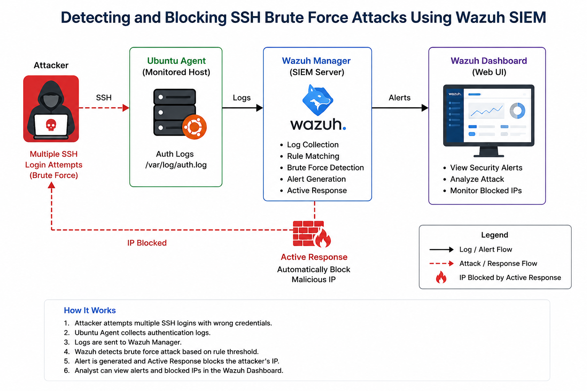
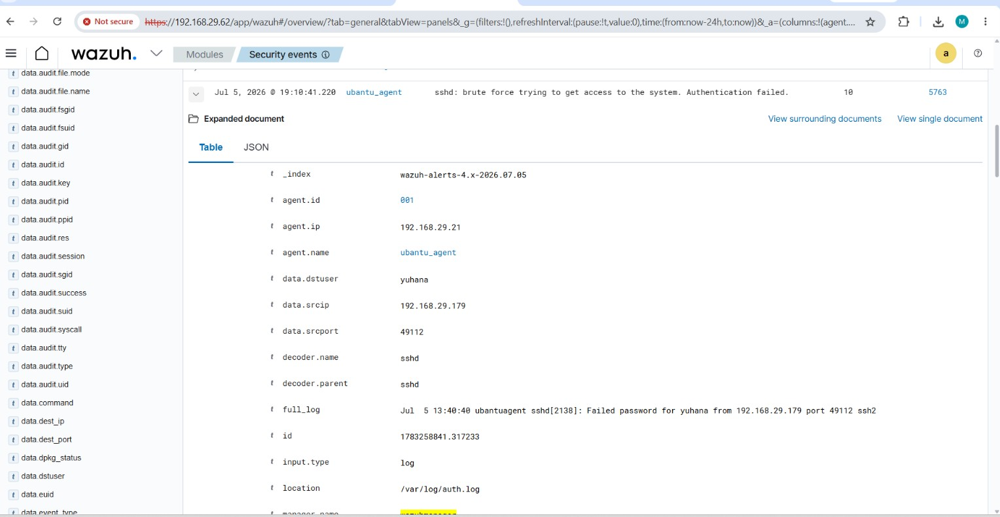
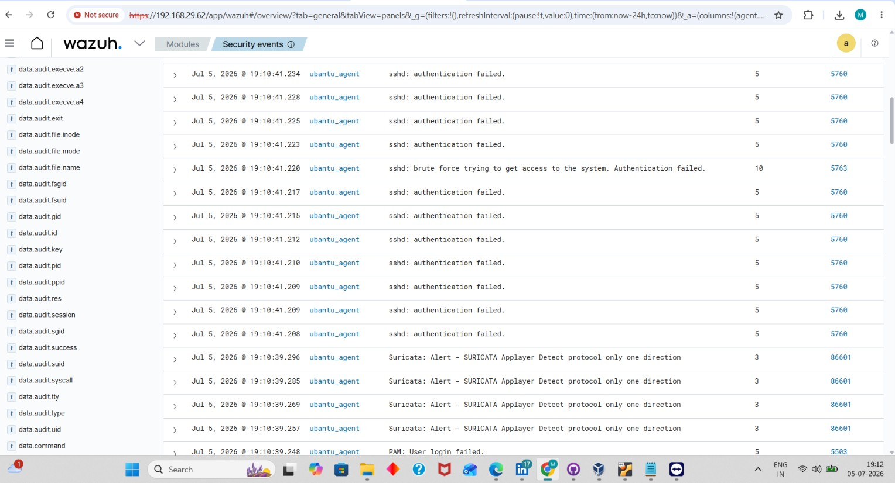
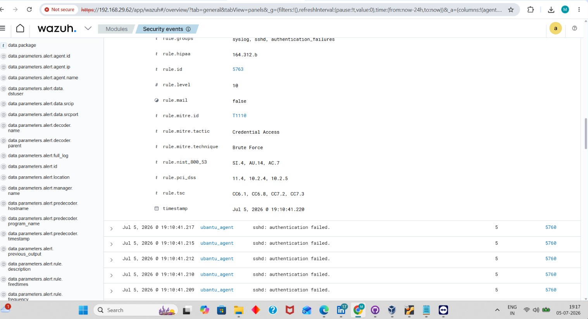
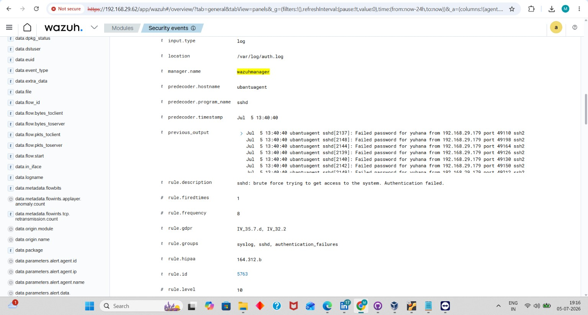
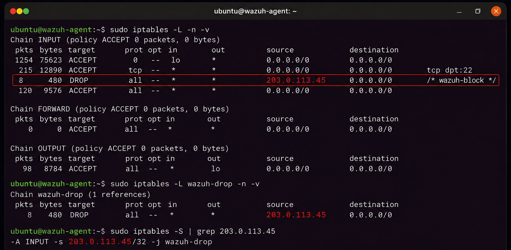

# Detecting and Blocking SSH Brute Force Attacks Using Wazuh SIEM

## Project Overview

This project demonstrates how **Wazuh SIEM** detects and automatically blocks **SSH brute force attacks** using log analysis and the **Active Response** feature.

The lab simulates repeated failed SSH login attempts against a Linux server. Wazuh identifies the attack, generates real-time alerts, and blocks the attacker's IP address to prevent further unauthorized access.

---

## Objectives

- Understand SSH brute force attacks
- Configure Wazuh Active Response
- Monitor SSH authentication logs
- Simulate SSH brute force attempts
- Detect repeated failed login attempts
- Automatically block malicious IP addresses
- Analyze security alerts

---

## Lab Environment

| Component | Details |
|-----------|----------|
| SIEM | Wazuh 4.x |
| Manager OS | Ubuntu Server |
| Agent OS | Ubuntu Server |
| Virtualization | VirtualBox |
| Monitoring Feature | SSH Brute Force Detection & Active Response |

---

## Architecture Diagram

<p align="center">
  
</p>

---

## Prerequisites

- Wazuh Manager installed
- Ubuntu Agent installed
- Agent connected to the Manager
- OpenSSH Server installed
- Root privileges

---

## Configure Active Response

Open the Wazuh configuration file:

```bash
sudo nano /var/ossec/etc/ossec.conf
```

Verify that the Active Response section is enabled.

Restart the Wazuh Manager:

```bash
sudo systemctl restart wazuh-manager
```

Restart the Wazuh Agent:

```bash
sudo systemctl restart wazuh-agent
```

---

## Verify Configuration

Check the Wazuh Manager status:

```bash
sudo systemctl status wazuh-manager
```

Check the Wazuh Agent status:

```bash
sudo systemctl status wazuh-agent
```

---

## Attack Simulation

Generate multiple failed SSH login attempts from another machine.

Example command:

```bash
ssh fakeuser@192.168.10.20
```

Enter an incorrect password several times.

Repeat the login attempts multiple times to simulate a brute force attack.

<p align="center">
  
</p>

---

## Detection Results

Wazuh successfully detected the SSH brute force attack and generated alerts for:

- Multiple failed SSH login attempts
- Authentication failures
- Suspicious source IP address
- SSH brute force detection rule triggered
- Active Response executed

<p align="center">
  
   
   
</p>

---

## Blocking the Attacker

After the attack threshold is reached, Wazuh Active Response blocks the attacker's IP address automatically.

Verify blocked IP addresses:

```bash
sudo iptables -L
```

or

```bash
sudo firewall-cmd --list-all
```

<p align="center">
  
</p>

---

## Visualize Alerts

Open the **Wazuh Dashboard**.

Navigate to:

**Threat Hunting**

Search for SSH authentication events:

```text
rule.groups:sshd
```

or

```text
rule.groups:authentication_failed
```

Review:

- Source IP
- Username
- Number of failed attempts
- Alert severity
- Timestamp
- Active Response status

---

## Incident Analysis

### MITRE ATT&CK Techniques

- **T1110** – Brute Force
- **T1078** – Valid Accounts
- **T1021.004** – Remote Services: SSH

### Potential Risks

- Unauthorized remote access
- Credential compromise
- Privilege escalation
- Lateral movement
- Server compromise

---

## Key Learnings

- Learned how SSH brute force attacks are detected.
- Configured Wazuh Active Response.
- Simulated repeated failed SSH login attempts.
- Automatically blocked malicious IP addresses.
- Investigated alerts using the Wazuh Dashboard.
- Understood the importance of automated threat response.

---
